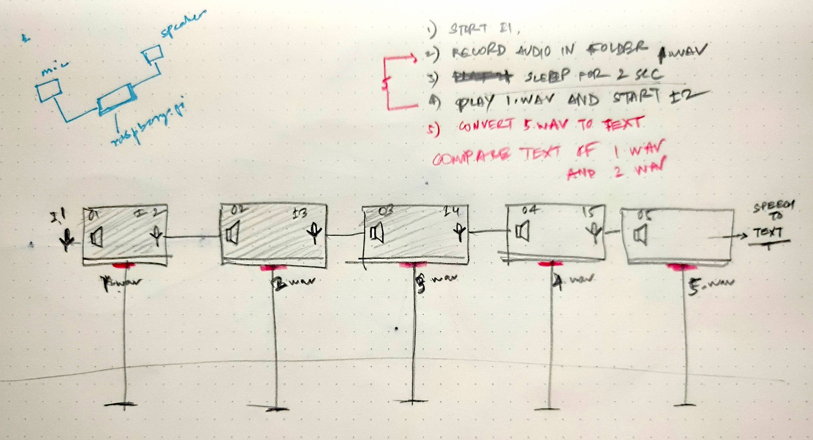

# Saachi Vaat 📢 🗣 📰
Saachi Vaat is a sound installation designed for the 4th Edition of Abhivyakti (Ahmedabad Art Festival) that explores
the distortion that is inherent in the transmission of information, especially in a post-truth society.

The installation employs an array of speakers and microphones installed in 7 terracotta chambers and record and play
spoken voice through the chambers in multiple hops, in the meantime also picking environmental noise and resonant
frequencies. These 14 sound devices (7 input and 7 output) are controlled by a Raspberry Pi 4 that also converts
recorded sound in the system for archival purposes.

## Architecture



The following instructions are directed assuming that a fresh installation is occurring on an updated version of Raspbian 4 with no modules/libraries installed and python3 already configured. The system specs and additional accessories used by us are as following:
1. Raspberry Pi 4 (Model B, Raspbian 4, 8GB RAM, 128GB Disk Space)
2. USB Sound Card (1 in, 2 out channels)
3. 7 x 48000 Hz Microphones
4. 7 x 2.1 Speakers
5. 7 x LEDs
6. 1 x Step down power converter
7. 7 x Sound amplifiers

To check if/version of python3 is installed on your Raspberry Pi, enter the following command on the terminal.

```commandline
python3 --version
```
Install `pip` to manage modules and libraries used in the code. 
1. Download the `get-pip.py` from [https://bootstrap.pypa.io/get-pip.py](https://bootstrap.pypa.io/get-pip.py) 
2. Open a terminal/command prompt, cd to the folder containing the get-pip.py file and run (If `pip` is already installed, update/upgrade it or simply skip this step):
```commandline
python3 get-pip.py
```
3. Install libraries used in this program:
```commandline
python3 -m pip install pyaudio speechrecognition sounddevice soundfile
```
